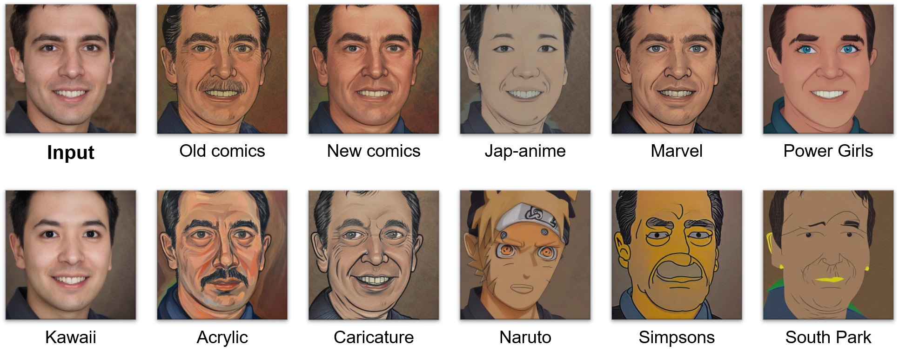
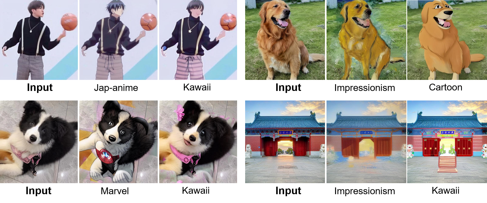
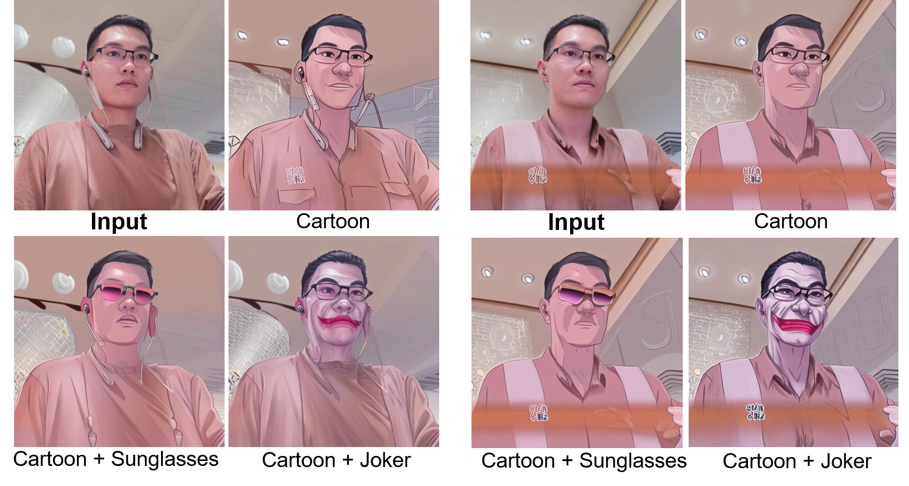

# DiffStyle: Leverage Diffusion Prior to One-for-All Style Transfer

> *Stable Diffusion* Implementation, our method is built on Prompt-to-Prompt and Null-Text


### [Project Page](https://prompt-to-prompt.github.io)&ensp;&ensp;&ensp;[Paper](https://prompt-to-prompt.github.io/ptp_files/Prompt-to-Prompt_preprint.pdf)


## Setup

This code was tested with Python 3.8, [Pytorch](https://pytorch.org/) 1.11 using pre-trained models through [huggingface / diffusers](https://github.com/huggingface/diffusers#readme).
Specifically, we implemented our method over  [Latent Diffusion](https://huggingface.co/CompVis/ldm-text2im-large-256) and  [Stable Diffusion](https://huggingface.co/CompVis/stable-diffusion-v1-4).
Additional required packages are listed in the requirements file.
The code was tested on a RTX3090 24GB but should work on other cards with at least **23GB** VRAM.

You can set up the conda environment with (python3.8+CUDA11.1) using the command below:
``` 
pip install -r requirements.txt
```

## QuickStart

To quickly generate results with **different styles and different extents**, you can use the following command:

``` 
bash bash/exp.sh
``` 
To quickly generate results with **editable style transfer**, you can use the following command:

``` 
bash bash/exp1.sh
``` 

Alternatively, you can use the following command to generate results with specific parameters:

``` 
python cartoon_styles.py --description "A handsome man in short hair" --path example_images/portrait5.jpg --blend man --self_ratio 0.2
``` 
The description `parameter` allows you to provide a description of the image. The `path` parameter allows you to specify the path of the image. The `blend` parameter allows you to specify the part of the image that you want to modify. The `self_ratio` parameter allows you to control the strength of the style, with a range of 0.2 to 0.8, where a smaller value results in a stronger style.


## Result

The generated images from the scripts above will be stored in the `\tmp` folder. We also provide some pre-generated results in the `\example_results` folder.

### One Model for All Styles
In these images, we show the results of generating multiple styles using a single model. These styles include different cartoon and art styles. By using a single model, we are able to generate multiple different styles in one run without the need to re-train the model or change parameters.




### Not Only Faces
This image shows that our model is not only able to perform style transfer on faces, but also on other types of images. In this image, we used a landscape image and transformed it into different style. This demonstrates the wide applicability of our model, which can be used for a variety of different types of images.



### Editable Style Transfer
This image shows that our style transfer model is editable. We can select any portion of the transformed image and adjust its style. In this image, we selected a portion of the face and applied a personal modification over it.



### Different Extent
In this image, we show that the strength of the generated style can be controlled. We demonstrate this by generating multiple images with the same source image and style, but with different levels of style intensity. The lefter image has a weaker style, while the righter image has a stronger style. This shows that our model is able to generate a range of different styles with varying levels of intensity.

